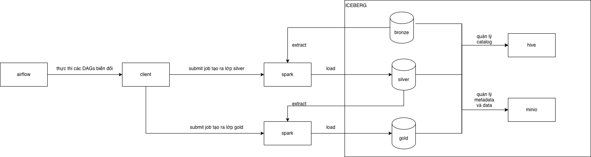

# Lakehouse Pipeline Demo

A comprehensive demonstration of a modern data lakehouse architecture using open-source technologies. This project showcases a complete data pipeline from ingestion to transformation, orchestrated across two servers.

Videos:

- [Lakehouse Ingestion 1](https://www.youtube.com/watch?v=GxTBjr51nQg)
- [Lakehouse Ingestion 2](https://www.youtube.com/watch?v=v2rJo33PBCw)
- [Lakehouse Transformation](https://www.youtube.com/watch?v=NIwk2DX44Ww)
- [Lakehouse Visualization]

Pipelines:

<figure align="center">
  
  <figcaption><em>Lakehouse Ingestion</em></figcaption>
</figure>

<figure align="center">
  
  <figcaption><em>Lakehouse Transformation</em></figcaption>
</figure>

## 📋 Table of Contents

- [Overview](#overview)
- [Architecture](#architecture)
- [Components](#components)
- [Prerequisites](#prerequisites)
- [Quick Start](#quick-start)
- [Services & Ports](#services--ports)
- [Configuration](#configuration)
- [Usage](#usage)
- [Project Structure](#project-structure)

## 🎯 Overview

This project demonstrates a production-ready lakehouse architecture with:

- **Data Ingestion**: Apache NiFi and Kafka for real-time and batch data ingestion
- **Data Orchestration**: Apache Airflow for workflow management
- **Data Processing**: Apache Spark for distributed data processing
- **Data Storage**: MinIO (S3-compatible) for object storage
- **Metadata Management**: Hive Metastore for table metadata
- **Stream Processing**: Kafka Streams and KSQL for real-time processing

## 🏗️ Architecture

The architecture is split across two servers:

### Server 1: Data Infrastructure
- **Storage**: MinIO (S3-compatible object storage)
- **Message Queue**: Apache Kafka ecosystem
- **Metadata**: Hive Metastore
- **Database**: PostgreSQL (for Airflow metadata)
- **Cache**: Redis (for Airflow Celery)

### Server 2: Processing & Orchestration
- **Orchestration**: Apache Airflow (Celery Executor)
- **Ingestion**: Apache NiFi
- **Processing**: Apache Spark (Master + Worker)

### Architecture Diagrams

See the `images/` directory for visual representations:
- `lakehouse ingestion.png` - Data ingestion flow
- `lakehouse_transformation.png` - Data transformation pipeline

## 🧩 Components

### Server 1 Services

| Service | Description | Version |
|---------|-------------|---------|
| **MinIO** | S3-compatible object storage | RELEASE.2025-09-07 |
| **PostgreSQL** | Database for Airflow metadata | 15 |
| **Redis** | Message broker for Airflow Celery | 7 |
| **Kafka Broker** | Distributed event streaming platform | 7.9.0 |
| **Schema Registry** | Schema management for Kafka | 7.9.0 |
| **Kafka Connect** | Framework for connecting Kafka with external systems | 7.7.1 |
| **Control Center** | Web UI for managing Kafka cluster | 7.9.0 |
| **KSQL Server** | SQL engine for Kafka stream processing | 7.9.0 |
| **Hive Metastore** | Metadata management service | 3.1.2 |

### Server 2 Services

| Service | Description | Version |
|---------|-------------|---------|
| **Apache Airflow** | Workflow orchestration platform | 3.1.4.3 |
| **Apache NiFi** | Data flow management | Latest |
| **Apache Spark Master** | Spark cluster master node | 3.5.2 |
| **Apache Spark Worker** | Spark cluster worker node | 3.5.2 |

## 📦 Prerequisites

- **Docker** (version 20.10 or higher)
- **Docker Compose** (version 2.0 or higher)
- **Minimum 8GB RAM** (recommended: 16GB)
- **Minimum 4 CPU cores** (recommended: 8 cores)
- **50GB free disk space**
- **Network access** between servers (if deploying on separate machines)

## 🚀 Quick Start

### 1. Clone the Repository

```bash
git clone <repository-url>
cd lakehouse-pipeline-demo
```

### 2. Start Server 1 (Infrastructure)

```bash
cd deploy/server1
docker-compose up -d
```

This will start:
- MinIO (object storage)
- PostgreSQL (database)
- Redis (cache)
- Kafka ecosystem (broker, schema registry, connect, control center, KSQL)
- Hive Metastore

### 3. Start Server 2 (Processing)

```bash
cd deploy/server2
docker-compose up -d
```

This will start:
- Apache Airflow
- Apache NiFi
- Apache Spark (master + worker)

### 4. Verify Services

Check that all services are running:

```bash
# Server 1
cd deploy/server1
docker-compose ps

# Server 2
cd deploy/server2
docker-compose ps
```

## 🔌 Services & Ports

### Server 1

| Service | Port | URL | Credentials |
|---------|------|-----|-------------|
| MinIO API | 9000 | http://localhost:9000 | levietnam/levietnam |
| MinIO Console | 9001 | http://localhost:9001 | levietnam/levietnam |
| PostgreSQL | 5432 | localhost:5432 | levietnam/levietnam |
| Redis | 6379 | localhost:6379 | - |
| Kafka Broker | 9092 | localhost:9092 | - |
| Schema Registry | 8081 | http://localhost:8081 | - |
| Kafka Connect | 8083 | http://localhost:8083 | - |
| Control Center | 9021 | http://localhost:9021 | - |
| KSQL Server | 8088 | http://localhost:8088 | - |
| Hive Metastore | 9083 | localhost:9083 | - |

### Server 2

| Service | Port | URL | Credentials |
|---------|------|-----|-------------|
| Airflow Web UI | 8080 | http://localhost:8080 | levietnam/levietnam |
| NiFi | 8081 | http://localhost:8081 | levietnam/ZpA7FQeW8XnD3mK2aJ9hYB5TtU6C4RVs |
| Spark Master UI | 8082 | http://localhost:8082 | - |
| Spark Worker UI | 8083 | http://localhost:8083 | - |
| Spark Master | 7077 | localhost:7077 | - |
| Spark UI (Worker) | 4040 | http://localhost:4040 | - |

## ⚙️ Configuration

### Environment Variables

#### Server 1
- Update IP addresses in `docker-compose.yaml` (replace `192.168.64.14` with your server IP)
- Default credentials can be changed in the environment variables section

#### Server 2
- Create a `.env` file in `deploy/server2/` directory (optional)
- Update database connection strings if using different server IPs
- Configure Airflow UID if needed

### Network Configuration

If deploying on separate servers, update the following in both `docker-compose.yaml` files:

1. Replace `192.168.64.14` with your actual Server 1 IP address
2. Ensure firewall rules allow communication between servers on required ports
3. Update Kafka advertised listeners with correct IP addresses

### Volume Mounts

Data persistence is configured via Docker volumes:
- `./data/` - Persistent data for Redis, MinIO, Kafka
- `./logs/` - Application logs
- `./dags/` - Airflow DAGs
- `./plugins/` - Airflow plugins

## 📖 Usage

### Accessing Services

1. **MinIO Console**: Navigate to http://localhost:9001
   - Create buckets for your data lake
   - Upload sample data files

2. **Airflow**: Navigate to http://localhost:8080
   - Create and manage data pipelines
   - Monitor DAG executions
   - View task logs

3. **NiFi**: Navigate to http://localhost:8081
   - Design data flow pipelines
   - Process and route data streams

4. **Kafka Control Center**: Navigate to http://localhost:9021
   - Monitor Kafka topics and consumers
   - View message streams
   - Manage connectors

5. **Spark Master UI**: Navigate to http://localhost:8082
   - Monitor Spark cluster status
   - View running applications

### Creating a Sample Pipeline

1. **Ingest Data via NiFi**:
   - Create a flow to read from a source (file, database, API)
   - Route data to Kafka or MinIO

2. **Process with Spark**:
   - Submit Spark jobs via Airflow DAGs
   - Read from MinIO (S3) and process data
   - Write results back to MinIO

3. **Orchestrate with Airflow**:
   - Create DAGs that coordinate NiFi, Spark, and other services
   - Schedule and monitor pipeline executions

### Example Airflow DAG

```python
from airflow import DAG
from airflow.operators.bash import BashOperator
from datetime import datetime

with DAG(
    'lakehouse_pipeline',
    start_date=datetime(2024, 1, 1),
    schedule_interval='@daily',
) as dag:
    
    spark_job = BashOperator(
        task_id='run_spark_job',
        bash_command='spark-submit --master spark://spark-master:7077 /path/to/job.py'
    )
```

## 📁 Project Structure

```
lakehouse-pipeline-demo/
├── deploy/
│   ├── server1/
│   │   └── docker-compose.yaml    # Infrastructure services
│   └── server2/
│       └── docker-compose.yaml    # Processing & orchestration services
├── images/
│   ├── lakehouse ingestion.png    # Ingestion architecture diagram
│   └── lakehouse_transformation.png # Transformation architecture diagram
└── README.md                       # This file

**Note**: Remember to update IP addresses and credentials before deploying to production environments.
